# Diagrama técnico C4 Nivel 2 – TERRA LINK

Este diagrama visualiza la arquitectura propuesta con los nuevos módulos (SatelliteService, BlockchainMintService, Compliance, Audit/ESG) y sus integraciones con la estructura actual.

## C4 Nivel 2 – Contenedores y Componentes principales

```mermaid
graph TB
    subgraph "Frontend Layer"
        WEB["🌐 Web App<br/>React/Next.js"]
        MOBILE["📱 Mobile App<br/>React Native"]
    end

    subgraph "API Gateway"
        APIGW["🔐 API Gateway<br/>NestJS + JWT + MFA<br/>RBAC Guards"]
    end

    subgraph "Backend Modules – Módulos Existentes"
        AUTH["🔑 Auth Module<br/>JWT + Sessions<br/>User Management"]
        USER["👤 User Module<br/>Roles: Admin, Producer,<br/>Bank, Merchant"]
        TENANT["🏢 Tenant Module<br/>Multi-tenant isolation<br/>Billing per tenant"]
        BILLING["💳 Billing Module<br/>Stripe integration<br/>Plans: Basic/Pro/Ent/Inst"]
    end

    subgraph "Backend Modules – Core Agrícola"
        GEO["🗺️ Geo Module<br/>PostGIS validation<br/>Area calculation"]
        NFT["🎨 NFT Module<br/>Metadata off-chain<br/>Token ID (será on-chain)"]
        CREDIT["💰 Credit Module<br/>Risk evaluation<br/>Proposal flow"]
        CREDIT_SC["⛓️ Credit Smart Contract<br/>Collateral locking<br/>WebSocket metrics"]
    end

    subgraph "Backend Modules – NUEVOS"
        SAT["🛰️ Satellite Module NEW<br/>Copernicus/Sentinel API<br/>Surface validation<br/>NDVI & coverage metrics"]
        
        BLOCKCHAIN_MINT["⛓️ Blockchain Mint NEW<br/>Polygon minting<br/>NFT token_id on-chain<br/>IPFS metadata upload"]
        
        COMPLIANCE["📋 Compliance Module NEW<br/>EUDR/TRACES registry<br/>DDS documentation<br/>Partner EORI management"]
        
        AUDIT_ESG["♻️ Audit & ESG Module NEW<br/>ESG reports<br/>Sustainability score<br/>Certification registry"]
    end

    subgraph "Data Layer"
        DB[(PostgreSQL<br/>+ PostGIS<br/>Plot, NFT, Credit,<br/>Billing, User,<br/>Certification,<br/>EudrRegistry,<br/>EsgReport)]
        
        CACHE["⚡ Redis Cache<br/>Session & temp data"]
    end

    subgraph "External Integrations"
        POLYGON["🔗 Polygon Network<br/>Smart Contracts<br/>NFT Minting<br/>Collateral Locking"]
        
        IPFS["📦 IPFS/Pinata<br/>Metadata storage<br/>Immutable docs<br/>Certificate storage"]
        
        STRIPE["💳 Stripe API<br/>Payments<br/>Subscriptions<br/>Webhooks"]
        
        COPERNICUS["🛰️ Copernicus/Sentinel<br/>Satellite imagery<br/>Geospatial data"]
        
        TRACES["🇪🇺 TRACES/EUDR<br/>Official EU registry<br/>DDS registration"]
        
        AWS_AUDIT["☁️ AWS CloudWatch<br/>+ S3 signed logs<br/>Immutable audit trail"]
    end

    subgraph "Real-time Communication"
        WEBSOCKET["📡 WebSocket Gateway<br/>Credit metrics<br/>Collateral updates<br/>Risk notifications"]
    end

    %% Frontend to API Gateway
    WEB -->|API calls| APIGW
    MOBILE -->|API calls| APIGW

    %% API Gateway to Auth
    APIGW -->|authenticate| AUTH
    AUTH -->|validate roles| APIGW

    %% API Gateway to User/Tenant/Billing
    APIGW -->|routes| USER
    APIGW -->|routes| TENANT
    APIGW -->|routes| BILLING
    TENANT -->|tenant context| APIGW

    %% API Gateway to Core Modules
    APIGW -->|routes| GEO
    APIGW -->|routes| NFT
    APIGW -->|routes| CREDIT

    %% API Gateway to NEW Modules
    APIGW -->|routes| SAT
    APIGW -->|routes| BLOCKCHAIN_MINT
    APIGW -->|routes| COMPLIANCE
    APIGW -->|routes| AUDIT_ESG

    %% Geo Module Integrations
    GEO -->|validate geojson| DB
    GEO -->|request satellite data| SAT
    SAT -->|fetch imagery| COPERNICUS
    SAT -->|store metrics| DB

    %% NFT Module Integrations
    NFT -->|read plot data| DB
    NFT -->|trigger minting| BLOCKCHAIN_MINT
    BLOCKCHAIN_MINT -->|mint on-chain| POLYGON
    BLOCKCHAIN_MINT -->|upload metadata| IPFS
    BLOCKCHAIN_MINT -->|persist token_id| DB

    %% Credit Module Integrations
    CREDIT -->|evaluate NFT| NFT
    CREDIT -->|store proposal| DB
    CREDIT -->|approve → collateral| CREDIT_SC
    CREDIT_SC -->|lock on-chain| POLYGON
    CREDIT_SC -->|metrics| WEBSOCKET

    %% Compliance Module
    COMPLIANCE -->|register EUDR| TRACES
    COMPLIANCE -->|store registry data| DB
    COMPLIANCE -->|persist DDS docs| IPFS

    %% Audit & ESG Module
    AUDIT_ESG -->|generate reports| DB
    AUDIT_ESG -->|audit events| AWS_AUDIT

    %% Billing
    BILLING -->|subscribe tenant| STRIPE
    BILLING -->|manage plans| DB
    STRIPE -->|payment webhooks| BILLING

    %% User/Auth logs
    USER -->|audit trail| AWS_AUDIT
    AUTH -->|login events| AWS_AUDIT

    %% WebSocket
    CREDIT -->|notify metrics| WEBSOCKET
    WEBSOCKET -->|broadcast updates| WEB
    WEBSOCKET -->|broadcast updates| MOBILE

    %% Data Layer connections
    GEO -->|read/write| DB
    NFT -->|read/write| DB
    CREDIT -->|read/write| DB
    BLOCKCHAIN_MINT -->|read/write| DB
    COMPLIANCE -->|read/write| DB
    AUDIT_ESG -->|read/write| DB
    AUTH -->|read/write| DB
    USER -->|read/write| DB
    TENANT -->|read/write| DB
    BILLING -->|read/write| DB

    %% Cache
    AUTH -->|cache sessions| CACHE
    CREDIT -->|cache risk scores| CACHE

    %% Styling
    classDef existing fill:#4A90E2,stroke:#2E5C8A,color:#fff,stroke-width:2px
    classDef new fill:#F5A623,stroke:#C67D1A,color:#fff,stroke-width:2px
    classDef external fill:#50E3C2,stroke:#2A8C6F,color:#000,stroke-width:2px
    classDef infra fill:#9B9B9B,stroke:#5A5A5A,color:#fff,stroke-width:2px

    class AUTH,USER,TENANT,BILLING,GEO,NFT,CREDIT,CREDIT_SC existing
    class SAT,BLOCKCHAIN_MINT,COMPLIANCE,AUDIT_ESG new
    class POLYGON,IPFS,STRIPE,COPERNICUS,TRACES,AWS_AUDIT external
    class DB,CACHE,WEBSOCKET,APIGW infra
```



## Resumen técnico actualizado

### Componentes clave

- **Backend (NestJS)**
  - `Auth Module` → JWT + MFA + RBAC.
  - `User/Tenant Module` → multi-tenancy y gestión de usuarios.
  - `Geo Module` → validación geoespacial con PostGIS + integración satelital.
  - `NFT Module` → creación y gestión de NFTs, vinculación con IPFS.
  - `Credit Module` → evaluación de riesgo, propuestas de crédito.
  - `Credit Smart Contract Module` → colateralización y bloqueo de NFTs en Polygon.
  - `Billing Module` → Stripe + planes (Básico, Pro, Enterprise, Institucional).
  - `Compliance Module (nuevo)` → integración TRACES/EUDR, registro DDS.
  - `Audit/ESG Module (nuevo)` → generación de reportes ESG y auditorías.
  - `SatelliteService (nuevo)` → consumo de Copernicus/Sentinel Hub.
  - `BlockchainMintService (nuevo)` → minting real en Polygon + subida de metadata a IPFS.

### Base de datos

- `Plot Entity` → geolocalización, superficie, validación satelital.
- `NftMetadata Entity` → metadatos extendidos, hash IPFS.
- `CreditProposal Entity` → propuestas de crédito, score de riesgo.
- `Certification Entity (nuevo)` → certificaciones EUDR/ESG.
- `EudrRegistry Entity (nuevo)` → registro de DDS y TRACES.
- `EsgReport Entity (nuevo)` → métricas ambientales/sociales.

### Blockchain layer

- `Smart Contracts` en Solidity → NFTs dinámicos con metadatos extendidos.
- `IPFS Storage` → almacenamiento inmutable de certificados y auditorías.
- `Dynamic NFT Collateral` → NFTs como garantía financiera.

### Infraestructura Cloud

- Microservicios en contenedores (Docker + Kubernetes).
- `Terraform` → infraestructura como código.
- `S3 + API Gateway` → almacenamiento seguro y control de acceso.
- `Prometheus + Grafana` → monitoreo y métricas.

### Integración de negocio

- `TERRA GO Marketplace` → compra/venta de lotes certificados.
- `TERRA X CHANGE Wallet` → pagos, staking, recompensas.
- `AG TECH EC` → fees por validaciones, listing y servicios premium.
- `Bancos/Cooperativas` → uso de NFTs como garantía crediticia.
- `Exportadores` → acceso a TRACES y reportes ESG.

## Resumen visual (texto)

1. **Frontend (Next.js)** → panel de trazabilidad y dashboards ESG.
2. **Backend (NestJS)** → módulos geo, nft, credit, compliance, audit.
3. **DB (PostGIS)** → entidades de lotes, NFTs, certificaciones.
4. **Blockchain (Polygon/IPFS)** → minting real + almacenamiento inmutable.
5. **Cloud (AWS EKS)** → despliegue escalable y seguro.
6. **Negocio (TERRA GO / X CHANGE)** → marketplace + wallet + fees.

## Flujos principales

### Flujo 1: Validación y creación de NFT

1. Productor envía GeoJSON + datos satelitales.
2. `Geo Module` valida geometría y superficie con PostGIS.
3. `SatelliteService` obtiene imágenes y métricas satelitales.
4. `NFT Module` crea metadata y solicita minting.
5. `BlockchainMintService` realiza minting en Polygon y sube metadata a IPFS.
6. Se almacena `token_id` on-chain y `ipfs_uri` en la base de datos.

### Flujo 2: Propuesta de crédito y colateralización

1. Banco revisa `CreditProposal` asociada a un NFT.
2. `Credit Module` calcula riesgo y límite ajustado.
3. Si se aprueba, `Credit Smart Contract Module` solicita bloqueo on-chain.
4. Polygon bloquea el NFT como garantía.
5. `WebSocket Gateway` notifica el estado a dashboards.
6. La base de datos actualiza el estado de colateralización.

### Flujo 3: Cumplimiento EUDR y ESG

1. Exportador solicita certificación EUDR.
2. `Compliance Module` registra el lote en TRACES/EUDR.
3. Los documentos DDS se almacenan en IPFS.
4. `Audit/ESG Module` genera reportes ESG.
5. Los eventos críticos se registran como logs inmutables en AWS.
6. El usuario recibe reporte y comprobante de cumplimiento.

## Integración de planes y productos

| Plan | Alcance | Precio anual |
|------|---------|--------------|
| **Básico** | GEO + NFT básico + SAT stub | $300 |
| **Pro** | GEO + NFT + SAT avanzado + scoring | $1,440 |
| **Enterprise** | + COMPLIANCE + AUDIT/ESG | $9,000 |
| **Institucional** | + APIs bancos + soporte dedicado | $30,000 |

---

## Notas de implementación

- `SatelliteService` debe proporcionar métricas NDVI, cobertura y riesgo.
- `BlockchainMintService` debe incluir validación de metadata antes del mint.
- `Compliance Module` debe ejecutar registros TRACES/EUDR con un partner EORI.
- `Audit/ESG Module` debe generar reportes auditables y almacenar hashes en IPFS/AWS.
- `Billing Module` debe mapear planes a features y habilitar acceso según suscripción.


---

## Flujos principales de datos

### Flujo 1: Validación y Creación de NFT (Productor)

```
Productor envía GeoJSON + datos satelitales
    ↓
GEO Module: valida geometría + area (PostGIS)
    ↓
SAT Module: obtiene imagen satelital (Copernicus)
    ↓
calcula NDVI, cobertura, score de validación
    ↓
NFT Module: crea metadata off-chain
    ↓
BLOCKCHAIN MINT: minting en Polygon + IPFS
    ↓
Retorna token_id on-chain + ipfs_uri
    ↓
NFT guardado en DB con referencias blockchain
```

### Flujo 2: Propuesta de Crédito y Colateralización (Banco)

```
Banco evalúa NFT para crédito
    ↓
CREDIT Module: evaluateCollateral(tokenId)
    ↓
valida riesgo, calcula límite ajustado por riesgo
    ↓
Banco aprueba propuesta
    ↓
CREDIT Module: updateProposalStatus('approved')
    ↓
CREDIT SMART CONTRACT: colateralizeToken(tokenId)
    ↓
BLOCKCHAIN: lock NFT en contrato inteligente
    ↓
WEBSOCKET: notifica estado a dashboard
    ↓
DB: marca NFT como collateralized
```

### Flujo 3: Cumplimiento EUDR y ESG (Exportador)

```
Exportador solicita certificación EUDR
    ↓
COMPLIANCE Module: initiate_eudr_registration(plot_id)
    ↓
registra en TRACES con socio europeo (EORI)
    ↓
almacena DDS y documentación en IPFS
    ↓
AUDIT/ESG Module: generate_esg_report()
    ↓
calcula score de sostenibilidad
    ↓
genera reporte PDF/JSON
    ↓
AUDIT LOG: registra eventos inmutables en AWS
    ↓
retorna reporte + registro EUDR al usuario
```

---

## Integración con Planes y Billing

| Plan | Módulos Habilitados | Costo anual |
|------|---------------------|-------------|
| **Básico** | GEO, NFT (básico), SAT (stub) | $300 |
| **Pro** | GEO, NFT, SAT (avanzado), Risk scoring | $1,440 |
| **Enterprise** | + COMPLIANCE (TRACES), AUDIT/ESG | $9,000 |
| **Institucional** | + API bancos, soporte dedicado, DAO | $30,000 |

---

## Migraciones de Base de Datos Necesarias

```sql
-- Nuevos campos en Plot
ALTER TABLE plots ADD COLUMN eudr_status VARCHAR(50);
ALTER TABLE plots ADD COLUMN esg_score DECIMAL(5,2);
ALTER TABLE plots ADD COLUMN audit_status VARCHAR(50);
ALTER TABLE plots ADD COLUMN certification_type VARCHAR(100);

-- Nuevos campos en NftMetadata
ALTER TABLE nft_metadata ADD COLUMN ipfs_uri VARCHAR(500);
ALTER TABLE nft_metadata ADD COLUMN blockchain_token_id VARCHAR(255);
ALTER TABLE nft_metadata ADD COLUMN eudr_registration_id VARCHAR(255);
ALTER TABLE nft_metadata ADD COLUMN esg_report_id INT;
ALTER TABLE nft_metadata ADD COLUMN source_satellite VARCHAR(50);

-- Nuevas tablas
CREATE TABLE eudr_registry (
  id SERIAL PRIMARY KEY,
  nft_metadata_token_id VARCHAR(255),
  eori_partner VARCHAR(100),
  registration_status VARCHAR(50),
  traces_registration_id VARCHAR(255),
  documents_uri VARCHAR(500),
  created_at TIMESTAMP DEFAULT NOW(),
  updated_at TIMESTAMP DEFAULT NOW()
);

CREATE TABLE esg_reports (
  id SERIAL PRIMARY KEY,
  nft_metadata_token_id VARCHAR(255),
  score DECIMAL(5,2),
  metrics JSON,
  report_uri VARCHAR(500),
  generated_at TIMESTAMP DEFAULT NOW(),
  created_at TIMESTAMP DEFAULT NOW()
);

CREATE TABLE audit_logs (
  id SERIAL PRIMARY KEY,
  tenant_id INT,
  user_id INT,
  action VARCHAR(255),
  resource_type VARCHAR(50),
  resource_id VARCHAR(255),
  details JSON,
  ipfs_uri VARCHAR(500),
  created_at TIMESTAMP DEFAULT NOW()
);
```

---

## Variables de Entorno Recomendadas

```env
# SATELLITE SERVICE
SATELLITE_PROVIDER=copernicus # copernicus, sentinel
COPERNICUS_API_KEY=xxx
COPERNICUS_API_URL=https://dataspace.copernicus.eu

# BLOCKCHAIN & IPFS
POLYGON_RPC_URL=https://polygon-rpc.com
AGRICULTURAL_NFT_CONTRACT_ADDRESS=0x...
BLOCKCHAIN_PRIVATE_KEY=xxx
IPFS_GATEWAY=https://ipfs.io
IPFS_API_URL=https://api.pinata.cloud
PINATA_API_KEY=xxx

# COMPLIANCE & EUDR
TRACES_API_URL=https://ec.europa.eu/taxation_customs/TRACES
TRACES_PARTNER_EORI=xxx
EUDR_ENABLED=true

# AUDITORÍA
AWS_REGION=us-east-1
AWS_S3_AUDIT_BUCKET=terra-link-audit-logs
AWS_CLOUDWATCH_LOG_GROUP=/terra-link/backend

# EXISTING
DATABASE_URL=postgres://...
JWT_SECRET=xxx
STRIPE_SECRET_KEY=sk_...
```

---

## Próximos pasos de implementación

1. **Semana 1-2:** Crear entidades nuevas, configurar variables de entorno, mock services.
2. **Semana 3-4:** Implementar SatelliteService, BlockchainMintService, persistencia.
3. **Semana 5-6:** Compliance y EUDR flow básico.
4. **Semana 7-8:** ESG reports, auditoría, WebSocket metrics.
5. **Semana 9-10:** Tests e2e, seguridad (MFA, RBAC), documentación.

---

Este diagrama proporciona una visión clara de cómo todos los módulos nuevos se integran con la arquitectura existente y cómo los datos fluyen a través del sistema. Tu equipo puede usar esto como referencia para estimar esfuerzo y dependencias entre tareas.
