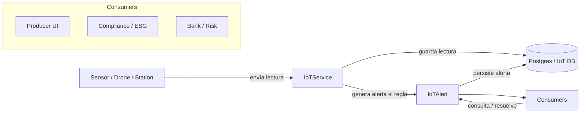

# 🧪 Guía de Pruebas – TERRA LINK

## 1. Objetivo
Asegurar que el proyecto TERRA LINK se levante correctamente y que sus módulos (Geo, NFT, Créditos) funcionen con calidad y seguridad.

---

## 2. Preparación del Entorno

### Backend
```bash
cd backend
npm install
npm run build
npm run start:dev
```

### Base de Datos
```bash
docker-compose up -d
```
- Contenedor: `postgres + postgis`
- Script inicial: `init.sql`

### Frontend
```bash
cd frontend
npm install
npm start
```

---

## 3. Pruebas Unitarias

Ejecutar:
```bash
cd backend
npm run test
npm run test:e2e
```

Validar:
- Registro y login con MFA (`/api/auth/register`, `/api/auth/login`)
- Validación geoespacial (`/api/validation/start`)
- Minting de NFT (`/api/nft/mint`)
- Propuesta de crédito (`/api/credit/proposal`)

---

## 4. Pruebas de Integración

### Flujo completo
1. **Registro** → Crear usuario con MFA.
2. **Validación** → Enviar datos satelitales/IoT.
3. **NFT** → Generar NFT dinámico con metadatos.
4. **Crédito** → Banco usa NFT como garantía.
5. **Marketplace** → Comerciante compra lote certificado.

---

## 10. Pruebas E2E de IoT Alerts
Para ejecutar las pruebas de alertas IoT junto con compliance:
```bash
cd backend
npm run test:e2e -- --runInBand test/compliance.e2e-spec.ts
```

Endpoints cubiertos:
- `GET /iot/alerts?unresolvedOnly=true`
- `GET /iot/alerts/:id`
- `POST /iot/alerts`
- `PATCH /iot/alerts/:id/resolve`

Escenarios principales:
- Crear una alerta manual con `POST /iot/alerts`
- Listar alertas activas con `GET /iot/alerts`
- Consultar una alerta por ID con `GET /iot/alerts/:id`
- Resolver una alerta con `PATCH /iot/alerts/:id/resolve`

Ejemplo rápido:
```bash
curl -X POST http://localhost:3000/iot/alerts \
  -H "Authorization: Bearer PRODUCER_TOKEN" \
  -H "Content-Type: application/json" \
  -d '{"plotId":1,"type":"ph","value":5.2,"threshold":6,"message":"Soil acidity below threshold"}'

curl http://localhost:3000/iot/alerts?unresolvedOnly=true \
  -H "Authorization: Bearer PRODUCER_TOKEN"

curl http://localhost:3000/iot/alerts/1 \
  -H "Authorization: Bearer PRODUCER_TOKEN"

curl -X PATCH http://localhost:3000/iot/alerts/1/resolve \
  -H "Authorization: Bearer PRODUCER_TOKEN"
```

### IoT Alerts API

Documentación rápida para los endpoints de alertas IoT (uso en Postman / curl).

1) Listar alertas

Request

http

```
GET /iot/alerts?unresolvedOnly=true
Authorization: Bearer <token>
```

Response

json

```
[
  {
    "id": "a1b2c3",
    "plotId": "plot-123",
    "type": "humidity",
    "value": 25,
    "threshold": 30,
    "message": "Humedad baja detectada",
    "createdAt": "2026-07-04T01:55:00.000Z",
    "resolved": false
  }
]
```

2) Obtener alerta por ID

Request

http

```
GET /iot/alerts/a1b2c3
Authorization: Bearer <token>
```

Response

json

```
{
  "id": "a1b2c3",
  "plotId": "plot-123",
  "type": "humidity",
  "value": 25,
  "threshold": 30,
  "message": "Humedad baja detectada",
  "createdAt": "2026-07-04T01:55:00.000Z",
  "resolved": false
}
```

3) Resolver alerta

Request

http

```
PATCH /iot/alerts/a1b2c3/resolve
Authorization: Bearer <token>
```

Response

json

```
{
  "id": "a1b2c3",
  "plotId": "plot-123",
  "type": "humidity",
  "value": 25,
  "threshold": 30,
  "message": "Humedad baja detectada",
  "createdAt": "2026-07-04T01:55:00.000Z",
  "resolved": true,
  "resolvedAt": "2026-07-04T02:00:00.000Z"
}
```

### IoT Alerts Dashboard API
**Endpoint**

```
GET /compliance/alerts-dashboard
Authorization: Bearer <token>
Headers:
  x-test-tenant: <tenantId>   // usado en pruebas e2e
```

**Descripción**
Devuelve métricas agregadas de alertas IoT por tenant, incluyendo severidad, tipos, recurrencia y resumen legible.

**Ejemplo de respuesta JSON**

json

```
{
  "totalUnresolved": 5,
  "bySeverity": {
    "critical": 2,
    "high": 1,
    "medium": 1,
    "low": 1
  },
  "byType": {
    "humidity": 3,
    "ndvi": 1,
    "pest": 1,
    "ph": 0
  },
  "recurringTypes": ["humidity"],
  "recentCount30d": 4,
  "summaryText": "IoT alerts: 5 unresolved (2 critical, 1 high, 1 medium, 1 low) | Recurring: humidity (30-day window). Recent (30d): 4"
}
```

**Roles permitidos**

- `admin`
- `banco`
- `productor`

Notes:
- Auth: usar JWT en `Authorization: Bearer <token>`.
- Multi‑tenant: los productores solo ven alertas de su `tenantId`; administradores ven todo.

**Diagrama: IoT Alerts Flow**



---

## 5. Pruebas de Seguridad

- Intento de login con MFA inválido → debe rechazar.
- JWT expirado → acceso denegado.
- SQL Injection → backend debe bloquear.
- Auditoría → logs en CloudWatch/IPFS deben registrar eventos.

---

## 6. Pruebas de Rendimiento

### Herramienta: k6
```bash
k6 run load-test.js
```

Escenarios:
- 1000 transacciones simultáneas en `/api/nft/mint`
- 500 usuarios concurrentes en login MFA
- Tiempo de respuesta promedio < 200ms

---

## 7. Pruebas de Aceptación (UAT)

- Productor puede registrar lote y generar NFT.
- Banco puede aprobar crédito con NFT como garantía.
- Comerciante puede comprar lote certificado.
- Wallet muestra balance y recompensas en tiempo real.

---

## 8. Scripts de Prueba

### `test-api.js`
Ejecutar:
```bash
node test-api.js
```
Valida endpoints básicos:
- Registro/Login
- Minting NFT
- Propuesta de crédito

---

## 9. Pruebas E2E de Compliance

Para ejecutar solo las pruebas de compliance:
```bash
cd backend
npm run test:e2e -- --runInBand test/compliance.e2e-spec.ts
```

Endpoints cubiertos:
- `POST /compliance/satellite-validation`
- `POST /compliance/certifications`
- `POST /compliance/eudr`
- `POST /compliance/esg-reports`

Matriz RBAC – Endpoints de Compliance

| Endpoint                          | Admin | Productor | Exportador | Banco |
|-----------------------------------|:-----:|:---------:|:----------:|:-----:|
| **POST /compliance/certifications**       | ✅    | ❌        | ✅         | ❌    |
| **POST /compliance/eudr**                 | ✅    | ❌        | ✅         | ❌    |
| **POST /compliance/esg-reports**          | ✅    | ❌        | ❌         | ✅    |
| **POST /compliance/satellite-validation** | ✅    | ✅        | ✅         | ✅    |

Roles esperados:
- `admin` para certificaciones y ESG
- `productor` para validación satelital
- `exportador` para registro EUDR
- `banco` para generación de reportes ESG

Ejemplos cURL por rol:

```bash
# 🟩 Admin – Crear certificación
curl -X POST http://localhost:3000/compliance/certifications \
  -H "Authorization: Bearer ADMIN_TOKEN" \
  -H "Content-Type: application/json" \
  -d '{
    "certificationId": "CERT-001",
    "details": "Certificación de prueba"
  }'

# 🟦 Productor – Validación satelital
curl -X POST http://localhost:3000/compliance/satellite-validation \
  -H "Authorization: Bearer PRODUCTOR_TOKEN" \
  -H "Content-Type: application/json" \
  -d '{
    "plotId": "123",
    "coordinates": { "type": "Polygon", "coordinates": [[[0,0],[1,0],[1,1],[0,1],[0,0]]] },
    "dateRange": { "from": "2020-01-01", "to": "2021-01-01" }
  }'

# 🟨 Exportador – Registrar EUDR
curl -X POST http://localhost:3000/compliance/eudr \
  -H "Authorization: Bearer EXPORTADOR_TOKEN" \
  -H "Content-Type: application/json" \
  -d '{
    "trace_id": "T-1",
    "registry_number": "EUDR-001",
    "plot_id": 1
  }'

# 🟥 Banco – Generar reporte ESG
curl -X POST http://localhost:3000/compliance/esg-reports \
  -H "Authorization: Bearer BANCO_TOKEN" \
  -H "Content-Type: application/json" \
  -d '{
    "plot_id": 1,
    "category": "water",
    "score": 80
  }'
```

### Notas
- Cada rol usa su **token JWT** correspondiente (`ADMIN_TOKEN`, `PRODUCTOR_TOKEN`, etc.).
- Los endpoints responden con `201` y un payload que incluye `id` o `validationResult`.
- Estos ejemplos sirven para pruebas manuales rápidas en consola o Postman.

Notas:
- **Admin** tiene acceso completo a todos los endpoints.  
- **Productor** solo puede ejecutar validaciones satelitales, no crear certificaciones ni registros.  
- **Exportador** puede registrar EUDR y validar satélite.  
- **Banco** puede generar reportes ESG y validar satélite.  

---

## ✅ Resultado esperado
- Proyecto levantado sin errores.
- APIs responden correctamente.
- NFTs funcionan como garantías financieras.
- Flujo completo validado: Productor → Banco → Comerciante → Wallet.
