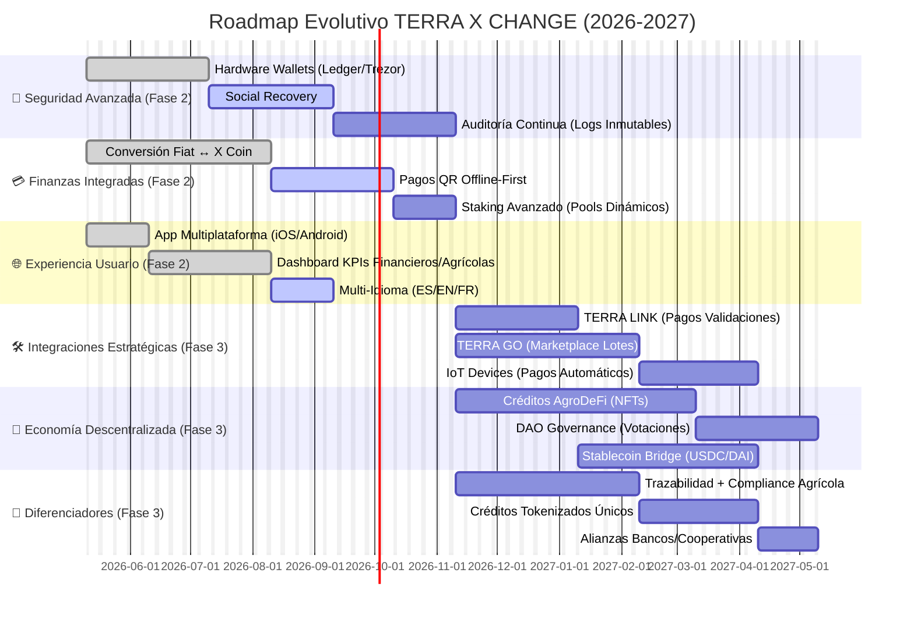

# Roadmap Visual - TERRA X CHANGE 🌾💰

## Diagrama de Gantt - Hitos Técnicos y de Negocio

```mermaid
gantt
    dateFormat  YYYY-MM-DD
    title       Roadmap Evolutivo TERRA X CHANGE (2026-2027)
    excludes    weekends
    %% todayMarker off

    section 🔐 Seguridad Avanzada (Fase 2)
    Hardware Wallets (Ledger/Trezor)     :done, 2026-05-10, 2026-07-10
    Social Recovery                     :active, 2026-07-10, 2026-09-10
    Auditoría Continua (Logs Inmutables) : 2026-09-10, 2026-11-10

    section 💳 Finanzas Integradas (Fase 2)
    Conversión Fiat ↔ X Coin            :done, 2026-05-10, 2026-08-10
    Pagos QR Offline-First              :active, 2026-08-10, 2026-10-10
    Staking Avanzado (Pools Dinámicos)  : 2026-10-10, 2026-11-10

    section 🌐 Experiencia Usuario (Fase 2)
    App Multiplataforma (iOS/Android)   :done, 2026-05-10, 2026-06-10
    Dashboard KPIs Financieros/Agrícolas:done, 2026-06-10, 2026-08-10
    Multi-Idioma (ES/EN/FR)             :active, 2026-08-10, 2026-09-10

    section 🛠️ Integraciones Estratégicas (Fase 3)
    TERRA LINK (Pagos Validaciones)     : 2026-11-10, 2027-01-10
    TERRA GO (Marketplace Lotes)        : 2026-11-10, 2027-02-10
    IoT Devices (Pagos Automáticos)     : 2027-02-10, 2027-04-10

    section 🏦 Economía Descentralizada (Fase 3)
    Créditos AgroDeFi (NFTs)            : 2026-11-10, 2027-03-10
    DAO Governance (Votaciones)         : 2027-03-10, 2027-05-10
    Stablecoin Bridge (USDC/DAI)        : 2027-01-10, 2027-04-10

    section 🚀 Diferenciadores (Fase 3)
    Trazabilidad + Compliance Agrícola  : 2026-11-10, 2027-02-10
    Créditos Tokenizados Únicos         : 2027-02-10, 2027-04-10
    Alianzas Bancos/Cooperativas        : 2027-04-10, 2027-05-10
```